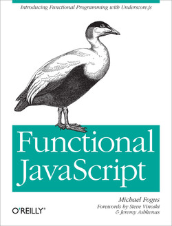

# 《Functional JavaScript》Learning Notes


## 1. Profiles



|    **Title**    | Functional JavaScript [ISBN: 9781449360726] |
| :-------------: | :-----------------------------------------: |
|   **Author**    |              **Michael Fogus**              |
| **Publication** |         **O'Reilly Media, 2013.5**          |
|    **Pages**    |                   **260**                   |

> **Introduction**
>
> How can you overcome JavaScript language oddities and unsafe features? With this book, you’ll learn how to create code that’s beautiful, safe, and simple to understand and test by using JavaScript’s functional programming support. Author *Michael Fogus* shows you how to apply functional-style concepts with `Underscore.js`, a JavaScript library that facilitates functional programming techniques. Sample code is available on GitHub at https://github.com/funjs/book-source.
>
> *Fogus* helps you think in a functional way to help you minimize complexity in the programs you build. If you’re a JavaScript programmer hoping to learn functional programming techniques, or a functional programmer looking to learn JavaScript, this book is the ideal introduction.
>
> - Use applicative programming techniques with first-class functions
> - Understand how and why you might leverage variable scoping and closures
> - Delve into higher-order functions -- and learn how they take other functions as arguments for maximum advantage
> - Explore ways to compose new functions from existing functions
> - Get around JavaScript’s limitations for using recursive functions
> - Reduce, hide, or eliminate the footprint of state change in your programs
> - Practice flow-based programming with chains and functional pipelines
> - Discover how to code without using classes


## 2. Outlines

Status available：:heavy_check_mark: (Completed) | :hourglass_flowing_sand: (Working) | :no_entry: (Not Started) | :orange_book: (Finish reading)

| No.  |                       Chapter Title                        |          Status          |
| :--: | :--------------------------------------------------------: | :----------------------: |
| Ch01 |       [Introducing Functional JavaScript](./Ch01.md)       | :hourglass_flowing_sand: |
| Ch02 |     [First-Class Functions and Applicative](./Ch02.md)     |        :no_entry:        |
| Ch03 |          [Variable Scope and Closures](./Ch03.md)          |        :no_entry:        |
| Ch04 |            [Higher-Order Functions](./Ch04.md)             |        :no_entry:        |
| Ch05 |          [Function-Building Functions](./Ch05.md)          |        :no_entry:        |
| Ch06 |                   [Recursion](./Ch06.md)                   |        :no_entry:        |
| Ch07 | [Purity, Immutability, and Policies for Change](./Ch07.md) |        :no_entry:        |
| Ch08 |            [Flow-Based Programming](./Ch08.md)             |        :no_entry:        |
| Ch09 |           [Programming Without Class](./Ch09.md)           |        :no_entry:        |


Powershell script for generating markdown files in batch:

```powershell
# Create 9 empty markdown files named Ch##.md:
for($i=1; $i -le 9; $i=$i+1){ New-Item -Name "Ch$('{0:d2}' -f $i).md"; }
```

 
